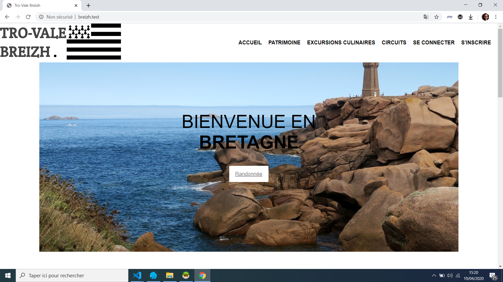

### Introduction



Tro-Vale Breizh est un site dédié à la randonnée en Bretagne, vous pouvez vous inscrire et par la suite vous créer
un espace membre afin de partager des itinéraire de ballades dans les différents lieux que composent cette belle région.

# Titre du projet

Tro-Vale Breizh

### Technologies

Les technologies utlisées pour ce projet sont les suivantes:

    * Visual studio code
    * HTML 5
    * CSS 3
    * JavaScript
    * JQuery 
    * API REST 'adresse.data.gouv'
    * API REST 'Carte à la carte' par l'IGNrando (à venir) 
    * PHP


### Installation

1. Cloner le dépôt via votre terminal de commande en utilisant la commande 
```

git clone git@github.com:Alban-78/breizh.git

```

2. Installer composer sur votre ordinateur puis via votre terminal de commande aller à la racine du dossier et faite un :

```

composer install

```

3. Faire un import de la base de donnée présente dans le dossier sql => app/public/sql et dans lequel se trouve un diagramme SQL qui shématise la base de donnée.

4. Dans le dossier manager.php, il faudra changer le nom de la base de donnée : 

```

class Manager
{
    protected function dbConnect()
    {
        try {
            $bdd = new \PDO('mysql:host=localhost;dbname=Votre_Nom_De_Db;charset=utf8', 'root', '');
            return $bdd;
        } catch (Exception $e) {
            die('Erreur : ' . $e->getMessage());
        }
    }
}

```

5. Aller sur votre navigateur et taper 'localhost'

6. Pour aller sur la partie admin vous pouvez entrer l'identifiant et mot de passe suivant:
   Votre nom => Alban
   Votre mot de passe => Kercode

### Autheur

HUSAR Alban


### Page à terminer

*Pouvoir ajouter des Administrateurs 
*Gérer les messages des utilisateurs via l'administrateur
*API carte à la carte à implémenter afin de pouvoir partager les circuits de randos sur des map.

